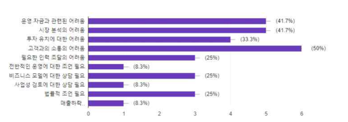
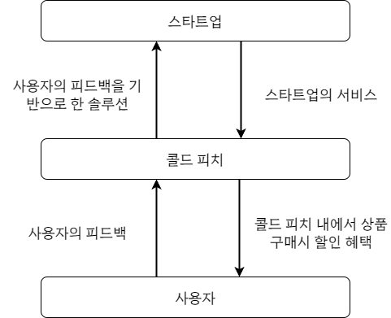
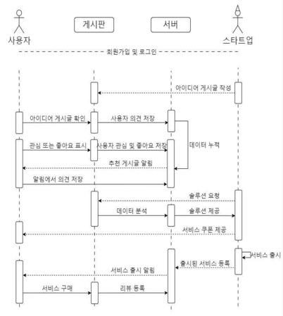
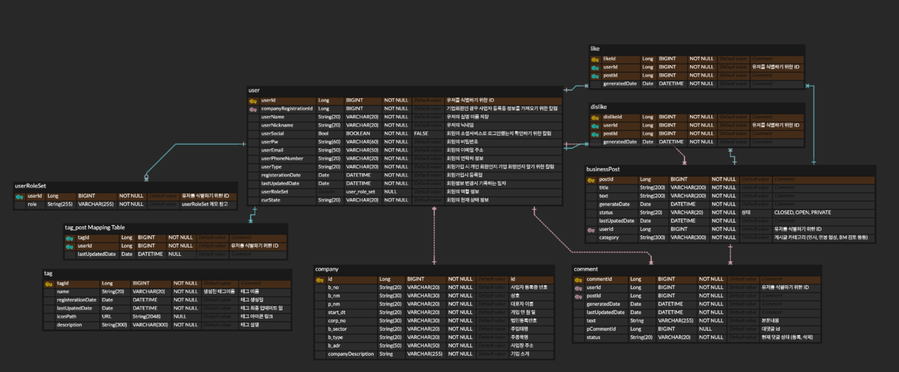
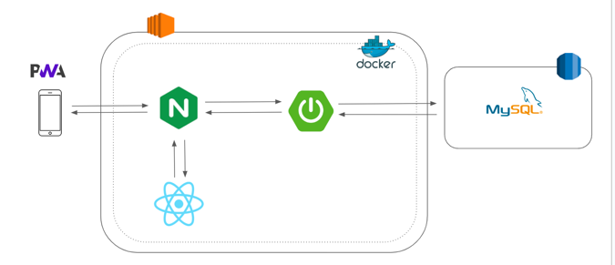

# 🍑 Cold_Pitch

 

## 🎟️ 프로젝트 주제

###  "초기 스타트업과 소비자 간의 상호작용을 촉진하는 플랫폼"

 

## ⌛️ 프로젝트 요약

| 분류 |           내용            | X |     스택     |  버전   |   
|----|:-----------------------:|---|:----------:|:-----:|
| 주제 | 스타트업 - 소비자 상호작용 촉진 플랫폼  | X |    JAVA    |  11   |
| 인원 |            6            | X | SpringBoot | 2.7.11 |
| 기간 | 2023.05.01 ~ 2023.07.21 | X |   MySQL    | latest      |

 

## 📘 프로젝트 배경

- 넓은 범위의 디지털 기기의 보급으로 정보의 양과 확산 속도가 급격하게 증가하여 이를 소비자들이 적극적으로 활용하고 있음.
- 이에 따라, 제품이나 서비스의 품질, 브랜드 이미지와 마케팅 전략 등에 소비자들의 평가와 선택이 큰 영향을 미치고 있음.

 

## 🔍 예상 기대효과
#### 경제적 효과
 1. 스타트업의 안정적 시장 진입과 성장
 2. 플랫폼 사용자 유치를 통한 스타트업 수익 창출
    
#### 기술적 효과
 1. 디지털 신기술의 활용
      
#### 사회적 효과
 1. 스타트업 커뮤니티 활성화
 2. 국내외 스타트업과의 교류와 유입
 3. 스타트업 생태계 확장에 따른 고용 창출

 

## 💻 개발내용 및 목표

<h3>서비스 다이어그램</h3>

 

<h3>시퀀스 다이어그램</h3>

 

<h3>ER 다이어그램</h3>

 

## 🛠️ 기술 스택 및 의존성

통합 개발 환경 :   
개발 언어 :  
개발 프레임 워크:     
데이터베이스 :  
배포 도구 :        
협업 도구 : 

 

 

## ☁️ 프로젝트 아키텍쳐

 

## 🗃️ 프로젝트 구조

 
프로젝트 구조 확인하기

~~~
├── ColdPitchApplication.java
├── aop
│   └── LoggingAspect.java
├── config
│   ├── Auditing
│   │   ├── AuditorAwareImpl.java
│   │   └── JpaAuditingConfig.java
│   ├── cloud
│   │   └── S3Config.java
│   ├── file
│   │   └── FileConfig.java
│   ├── okHttp
│   │   └── OkHttpClientConfig.java
│   ├── querydsl
│   │   └── QuerydslConfiguration.java
│   ├── security
│   │   ├── CorsConfig.java
│   │   ├── JwtConfig.java
│   │   └── SecurityConfig.java
│   └── swagger
│       └── SwaggerConfig.java
├── core
│   ├── factory
│   │   └── YamlLoadFactory.java
│   └── manager
│       ├── AbstractFileManager.java
│       └── FileManager.java
├── domain
│   ├── apicontroller
│   │   ├── CommentApiController.java
│   │   ├── CompanyRegistrationController.java
│   │   ├── FileApiController.java
│   │   ├── HelloApiController.java
│   │   ├── PostApiController.java
│   │   ├── SolutionApiController.java
│   │   ├── TagApiController.java
│   │   ├── UserApiController.java
│   │   ├── UserAuthApiController.java
│   │   └── UserTagController.java
│   ├── entity
│   │   ├── BaseEntity.java
│   │   ├── Comment.java
│   │   ├── CompanyRegistration.java
│   │   ├── Dislike.java
│   │   ├── File.java
│   │   ├── FileStatus.java
│   │   ├── Hello.java
│   │   ├── Like.java
│   │   ├── Post.java
│   │   ├── Solution.java
│   │   ├── Tag.java
│   │   ├── User.java
│   │   ├── UserTag.java
│   │   ├── comment
│   │   │   ├── CommentRequestType.java
│   │   │   └── CommentState.java
│   │   ├── dto
│   │   │   ├── comment
│   │   │   │   ├── CommentRequestDto.java
│   │   │   │   └── CommentResponseDto.java
│   │   │   ├── companyRegistraion
│   │   │   │   ├── CompanyRegistrationDto.java
│   │   │   │   └── CompanyRegistrationValidationDto.java
│   │   │   ├── file
│   │   │   │   ├── FileUploadRequest.java
│   │   │   │   └── FileUploadResponse.java
│   │   │   ├── jwt
│   │   │   │   ├── RefreshToken.java
│   │   │   │   ├── TokenDto.java
│   │   │   │   └── TokenRequestDto.java
│   │   │   ├── post
│   │   │   │   ├── PostRequestDto.java
│   │   │   │   └── PostResponseDto.java
│   │   │   ├── solution
│   │   │   │   ├── SolutionRequestDto.java
│   │   │   │   └── SolutionResponseDto.java
│   │   │   ├── tag
│   │   │   │   └── TagRequestDto.java
│   │   │   ├── user
│   │   │   │   ├── CompanyRequestDto.java
│   │   │   │   ├── CompanyResponseDto.java
│   │   │   │   ├── LoginDto.java
│   │   │   │   ├── UserRequestDto.java
│   │   │   │   └── UserResponseDto.java
│   │   │   └── usertag
│   │   │       ├── TagRequestDto.java
│   │   │       └── TagResponseDto.java
│   │   ├── post
│   │   │   ├── Category.java
│   │   │   ├── LikeState.java
│   │   │   └── PostState.java
│   │   ├── solution
│   │   │   └── SolutionState.java
│   │   ├── tag
│   │   │   └── TagName.java
│   │   └── user
│   │       ├── CurState.java
│   │       └── UserType.java
│   ├── repository
│   │   ├── CommentRepository.java
│   │   ├── CommentRepositoryCustom.java
│   │   ├── CommentRepositoryImpl.java
│   │   ├── CompanyRegistrationRepository.java
│   │   ├── DislikeRepository.java
│   │   ├── FileJPARepository.java
│   │   ├── FileQueryRepository.java
│   │   ├── FileRepository.java
│   │   ├── FileRepositoryCustom.java
│   │   ├── HelloRepository.java
│   │   ├── LikeRepository.java
│   │   ├── PostRepository.java
│   │   ├── PostRepositoryCustom.java
│   │   ├── PostRepositoryImpl.java
│   │   ├── RefreshTokenRepository.java
│   │   ├── SolutionRepository.java
│   │   ├── SolutionRepositoryCustom.java
│   │   ├── SolutionRepositoryImpl.java
│   │   ├── TagRepository.java
│   │   ├── UserRepository.java
│   │   ├── UserRepositoryCustom.java
│   │   ├── UserRepositoryCustomImpl.java
│   │   ├── UserTagRepository.java
│   │   └── support
│   │       └── Querydsl4RepositorySupport.java
│   └── service
│       ├── CommentService.java
│       ├── CompanyRegistrationService.java
│       ├── CompanyRegistrationValidator.java
│       ├── CustomUserDetailService.java
│       ├── FileService.java
│       ├── HelloService.java
│       ├── PostService.java
│       ├── RefreshTokenService.java
│       ├── SolutionService.java
│       ├── TagService.java
│       ├── UserService.java
│       └── UserTagService.java
├── exception
│   ├── CustomException.java
│   ├── CustomSecurityException.java
│   ├── ExceptionHandleFilter.java
│   └── handler
│       ├── ErrorCode.java
│       ├── ErrorResponse.java
│       └── GlobalExceptionHandler.java
├── jwt
│   ├── JwtFilter.java
│   ├── TokenProvider.java
│   └── exception
│       ├── JwtAccessDeniedHandler.java
│       └── JwtAuthenticationEntryPoint.java
└── utils
    ├── RandomUtil.java
    ├── SecurityUtil.java
    └── ServerUtil.java
~~~

## 😉 오류처리

 오류 처리 문서

HTTP 상태 코드

| 상태  |         코드          |               	메시지               |
|-----|:-------------------:|:--------------------------------:|
| 204 |  해당 컨텐츠를 찾을 수 없습니다  |    	요청한 컨텐츠를 찾을 수 없을 때 반환됩니다.    |
| 301 |    URI가 변경되었습니다	    |      요청한 URI가 변경되었음을 나타냅니다.      |
| 400 |     잘못된 요청입니다	      |      클라이언트의 잘못된 요청을 나타냅니다.       |
| 403 |    접근 권한이 없습니다	     |       접근 권한이 없는 경우 반환됩니다.        |
| 404 | 해당 컨텐츠가 존재하지 않습니다	  |    요청한 컨텐츠가 존재하지 않을 때 반환됩니다.     |
| 405 |    잘못된 접근 방식입니다     | 	요청에 사용된 HTTP 메서드가 잘못되었음을 나타냅니다. |
| 408 |  접근 요청시간이 만료되었습니다   |      	요청 시간이 만료되었을 때 반환됩니다.      |
| 500 | 내부적인 서버 에러가 발생했습니다	 | 서버 내부에서 예기치 않은 에러가 발생한 경우 반환됩니다. |
| 501 |   구현되지 않은 기능입니다	    |    요청한 기능이 구현되지 않은 경우 반환됩니다.     |
| 401 | JWT 서명이 존재하지 않습니다	  |       JWT 서명이 없을 때 반환됩니다.        |
| 403 |     권한이 맞지 않습니다     |       	권한이 맞지 않을 때 반환됩니다.        |

## 🧐 비즈니스 로직

초기 비즈니스 모델

 

메인 비즈니스 모델

 

확장 비즈니스 모델

 

 

## 👥 팀원 소개

<table>
  <tbody>
    <tr>
        <td align="center"> 팀장 </td>
        <td align="center"> 팀원 </td>
        <td align="center"> 팀원 </td>
        <td align="center"> 팀원 </td>
        <td align="center"> 팀원 </td>
        <td align="center"> 팀원 </td>
    </tr>
    <tr>
        <td>  </td>
        <td>  </td>
        <td>  </td>
        <td>  </td>
        <td>  </td>
        <td>  </td>
    </tr>
    <tr>
      <td align="center"><a href="https://github.com/sangdob"> 박상도 </a></td>
      <td align="center"><a href="https://github.com/mon0mon"> 이민기 </a></td>
      <td align="center"><a href="https://github.com/dyKim"> 김도영 </a></td>
      <td align="center"><a href="https://github.com/dlrjs2360"> 이희건 </a></td>
      <td align="center"><a href="https://github.com/juhee77"> 박주희 </a></td>
      <td align="center"><a href="https://github.com/bear31eun"> 이정은 </a></td>
    </tr>

  </tbody>
</table>

## 🗂️ 버전기록

  
